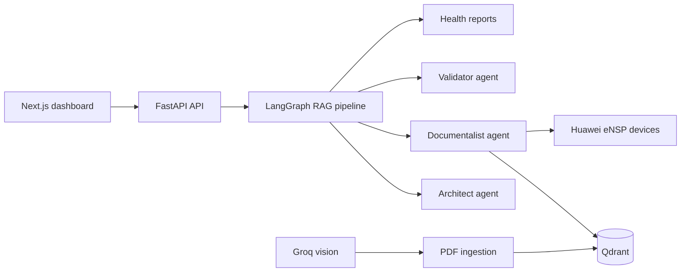

# Huawei Multimodal RAG

Assistant intelligent d'exploitation réseau Huawei, conçu pour interroger des manuels techniques, analyser l'état réel des équipements eNSP et produire des réponses vérifiables en français.

Le projet combine une recherche documentaire hybride, une orchestration multi-agents et une interface web opérationnelle. Il peut fonctionner en mode documentaire seul ou en mode hybride, avec comparaison entre les exigences des manuels et les données collectées sur les équipements.

## Fonctionnalités

- Chat technique en langage naturel pour les réseaux Huawei VRP.
- Pipeline LangGraph en trois étapes : Architecte, Documentaliste, Validateur.
- Recherche RAG hybride dense et sparse dans Qdrant.
- Ingestion de documents PDF avec extraction du texte, des tableaux et des images.
- Analyse optionnelle des images techniques par modèle de vision Groq.
- Connexion live aux équipements eNSP via SSH ou Telnet et Netmiko.
- Vérification d'état des interfaces, VLAN, routes, CPU, mémoire et voisins OSPF.
- Détection des écarts entre documentation et configuration réelle.
- Génération de rapports de santé PDF.
- Assistant de commandes VRP avec proposition, niveau de risque et confirmation avant application.
- Assistant de conception pour prévisualiser ou appliquer une mise à jour de la topologie.
- Interface Next.js avec tableaux de bord, historique, documents, rapports et topologie.

## Architecture



### Pipeline de réponse

1. L'Agent Architecte identifie l'intention, les équipements, les protocoles et la stratégie de recherche.
2. L'Agent Documentaliste récupère les sources pertinentes dans Qdrant et, si nécessaire, les données live des équipements.
3. L'Agent Validateur vérifie les faits, sépare les sources documentaires des données terrain et rédige la réponse finale avec confiance, alertes et recommandations.

## Technologies

| Couche | Technologies |
| --- | --- |
| Frontend | Next.js 15, React 19, TypeScript, Recharts, React Markdown |
| API | FastAPI, Pydantic, Uvicorn |
| Orchestration | LangGraph |
| IA | Groq, modèles de raisonnement et vision, fallback Gemini optionnel |
| Recherche | Qdrant, FastEmbed, recherche dense + BM25 sparse |
| Réseau | Netmiko, SSH/Telnet, Huawei VRP/eNSP |
| Documents | PyMuPDF, extraction de tableaux et images, FPDF |

## Prérequis

- Python 3.11 ou 3.12 recommandé.
- Node.js 18.18 ou plus récent et npm.
- Docker Desktop si Qdrant est lancé localement dans un conteneur.
- Une clé Groq pour les réponses LLM et l'analyse vision en mode production.
- Des équipements eNSP joignables uniquement pour les fonctions live et de remédiation.

Le fichier `backend/requirement.txt` est actuellement vide. Les dépendances Python peuvent être installées avec la commande ci-dessous; il est recommandé de générer ensuite un fichier de requirements versionné pour les déploiements reproductibles.

## Installation

### 1. Cloner le dépôt

```bash
git clone https://github.com/rebhimariem27-tech/Huawei.git
cd Huawei
```

### 2. Préparer Python

Windows PowerShell :

```powershell
python -m venv .venv
.\.venv\Scripts\Activate.ps1
python -m pip install --upgrade pip
python -m pip install fastapi "uvicorn[standard]" python-multipart pydantic python-dotenv groq qdrant-client fastembed pymupdf pyyaml netmiko langgraph fpdf2
```

Linux/macOS :

```bash
python3 -m venv .venv
source .venv/bin/activate
python -m pip install --upgrade pip
python -m pip install fastapi "uvicorn[standard]" python-multipart pydantic python-dotenv groq qdrant-client fastembed pymupdf pyyaml netmiko langgraph fpdf2
```

### 3. Installer le frontend

```bash
cd frontend
npm install
cd ..
```

### 4. Démarrer Qdrant

Avec Docker :

```bash
docker run -d --name huawei-qdrant -p 6333:6333 -p 6334:6334 qdrant/qdrant
```

L'application attend par défaut Qdrant sur `localhost:6333`.

## Configuration

Créer un fichier `.env` à la racine du projet. Ne jamais publier ce fichier ni une clé API dans Git.

```dotenv
GROQ_API_KEY=gsk_...
# Optionnel: utilisé par le client de fallback LLM
GEMINI_API_KEY=...
```

Pour le frontend, la variable suivante peut être définie dans `frontend/.env.local` :

```dotenv
NEXT_PUBLIC_API_URL=http://localhost:8000
```

La topologie et les paramètres d'accès aux équipements sont définis dans `backend/agents/topology.yaml`. Remplacer impérativement les identifiants d'exemple avant toute connexion à un environnement réel.

## Démarrage

Ouvrir deux terminaux à la racine du projet.

### Backend

```powershell
.\.venv\Scripts\Activate.ps1
cd api
python main.py
```

L'API est disponible sur `http://localhost:8000`.

- Documentation interactive : `http://localhost:8000/docs`
- Vérification de santé : `http://localhost:8000/health`

### Frontend

```powershell
cd frontend
npm run dev
```

L'interface est disponible sur `http://localhost:3000`.

Pour une exécution de production :

```bash
npm run build
npm run start
```

## Ingestion d'un PDF

1. Démarrer Qdrant et l'API.
2. Ouvrir le dashboard sur `http://localhost:3000`.
3. Utiliser la zone d'upload pour envoyer un PDF technique.
4. Le pipeline extrait le contenu, crée les chunks, génère les embeddings et indexe le document dans la collection `huawei_industrial_docs`.

L'analyse vision est activée automatiquement lorsque `GROQ_API_KEY` est disponible. Sans clé, le pipeline peut utiliser le mode mock prévu pour le développement.

## API principale

| Méthode | Endpoint | Description |
| --- | --- | --- |
| `GET` | `/health` | État de Qdrant, Groq, ingestion et équipements |
| `POST` | `/query` | Exécute le pipeline RAG complet |
| `POST` | `/query/stream` | Exécute le pipeline avec événements SSE |
| `POST` | `/ingest` | Upload et indexation d'un PDF |
| `GET` | `/files` | Liste des documents ingérés |
| `GET` | `/reports` | Liste les rapports générés |
| `GET` | `/devices/{name}/status` | Collecte l'état live d'un équipement |
| `POST` | `/devices/{name}/remediate` | Applique une commande de remédiation |
| `POST` | `/devices/{name}/terminal` | Exécute des commandes terminal |
| `GET` | `/topology` | Retourne la topologie courante |
| `POST` | `/design/deploy` | Prévisualise ou applique une évolution de topologie |
| `POST` | `/commands/propose` | Génère une proposition de commandes VRP |
| `POST` | `/commands/apply` | Applique les commandes après confirmation |

Exemple de requête :

```bash
curl -X POST http://localhost:8000/query \
  -H "Content-Type: application/json" \
  -d '{"query":"Quel est l’état actuel des interfaces de S1 ?"}'
```

## Sécurité et précautions

- Les endpoints de remédiation, de terminal et d'application de commandes peuvent modifier un équipement réel.
- Toujours vérifier l'équipement cible, la commande et le niveau de risque avant confirmation.
- Utiliser un compte réseau dédié avec les privilèges strictement nécessaires.
- Ne pas versionner `.env`, mots de passe, clés API, dumps d'équipements, uploads ou bases Qdrant locales.
- Tester les changements dans un lab eNSP avant tout déploiement en production.
- Les réponses générées par un LLM doivent être vérifiées contre les sources et l'état réel du réseau.

## Structure du dépôt

```text
api/                         API FastAPI et routes HTTP
backend/agents/              Agents LangGraph et topologie YAML
backend/ingestion/           Extraction PDF, chunking et vision
backend/vectorstore/         Embeddings et recherche hybride Qdrant
backend/llm/                 Client LLM avec fallback
frontend/                    Application Next.js
diagrams/                    Diagrammes d'architecture
reports/                     Rapports générés
```

## État du projet

Le projet est fonctionnel pour un environnement local de démonstration et de laboratoire. La configuration de production doit encore inclure une gestion des secrets, un fichier de dépendances Python versionné, une authentification API, une validation renforcée des commandes et une configuration Qdrant externalisée.

## Licence

Aucune licence open source n'est actuellement déclarée dans le dépôt. Ajouter un fichier `LICENSE` avant toute redistribution publique.
