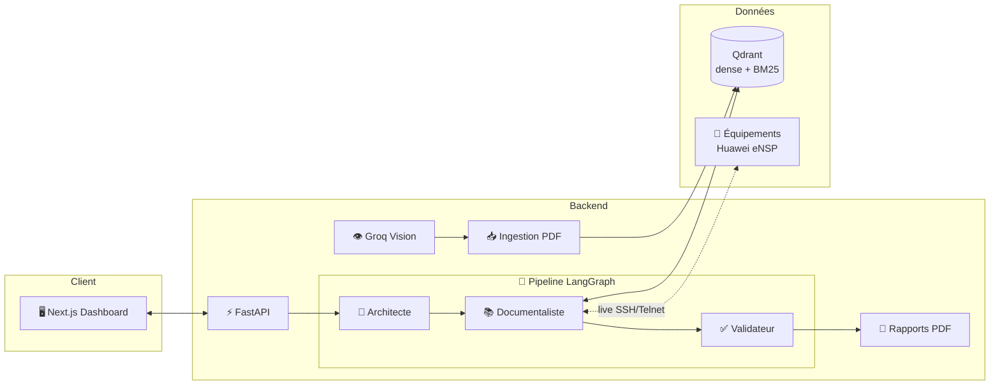

<div align="center">

# 🛰️ NetRAG

### Assistant IA d'exploitation réseau Huawei — RAG multimodal + diagnostic live eNSP

*Interrogez vos manuels techniques, comparez-les à l'état réel de vos équipements et obtenez des réponses vérifiables en français.*

<br/>


[**🎬 Démo**](#-démo) •
[**✨ Fonctionnalités**](#-fonctionnalités) •
[**🏗️ Architecture**](#️-architecture) •
[**🚀 Démarrage rapide**](#-démarrage-rapide) •
[**📡 API**](#-api) •
[**🔐 Sécurité**](#-sécurité)

</div>

---

## 🎬 Démo

<div align="center">

<!-- Remplacer par votre GIF / vidéo (idéalement 1280×720, < 10 Mo) -->


<sub>▶️ Version complète : <a href="https://youtu.be/VOTRE_LIEN">vidéo de démonstration (3 min)</a></sub>

</div>

### Aperçu de l'interface

| 💬 Chat technique | 📊 Tableau de bord |
| :---: | :---: |
|  |  |
| **🗺️ Topologie réseau** | **📄 Rapports de santé** |
|  |  |

### Scénario de démonstration

| Étape | Action | Ce que vous voyez |
| :---: | --- | --- |
| **1** | Importer un manuel Huawei (PDF) | Extraction du texte, des tableaux et des images, puis indexation dans Qdrant |
| **2** | *« Comment configurer OSPF area 0 sur un S5700 ? »* | Réponse sourcée avec niveau de confiance et références du manuel |
| **3** | *« Quel est l'état actuel des interfaces de S1 ? »* | Collecte live via SSH/Telnet et comparaison avec la documentation |
| **4** | *« Propose les commandes pour créer le VLAN 10 »* | Commandes VRP, niveau de risque, **confirmation obligatoire** avant application |
| **5** | Générer un rapport de santé | Export PDF : CPU, mémoire, VLAN, routes, voisins OSPF, alertes |

---

## 🎯 Pourquoi NetRAG ?

Un ingénieur réseau perd un temps considérable à naviguer entre manuels PDF, CLI et documentation de topologie. **NetRAG** unifie ces trois sources dans une seule interface conversationnelle :

- 📚 **Savoir** — recherche hybride (dense + BM25) dans vos manuels techniques
- 🔌 **Terrain** — état réel des équipements eNSP collecté en direct
- ⚖️ **Écart** — détection automatique des différences entre ce que la doc exige et ce qui est configuré

Chaque réponse sépare clairement **sources documentaires** et **données terrain**, avec confiance, alertes et recommandations.

---

## ✨ Fonctionnalités

<table>
<tr>
<td width="50%" valign="top">

### 🧠 Intelligence
- Chat en langage naturel pour Huawei VRP
- Pipeline LangGraph : **Architecte → Documentaliste → Validateur**
- RAG hybride dense + sparse dans Qdrant
- Fallback LLM (Groq → Gemini optionnel)
- Réponses en français, vérifiables et sourcées

</td>
<td width="50%" valign="top">

### 📄 Documents multimodaux
- Ingestion PDF : texte, tableaux et images
- Analyse des schémas par modèle de vision Groq
- Chunking, embeddings FastEmbed, indexation automatique
- Gestion des documents depuis l'interface

</td>
</tr>
<tr>
<td width="50%" valign="top">

### 🔌 Opérations réseau
- Connexion live eNSP (SSH / Telnet via Netmiko)
- Interfaces, VLAN, routes, CPU, mémoire, voisins OSPF
- Détection des écarts documentation ↔ configuration
- Rapports de santé PDF

</td>
<td width="50%" valign="top">

### 🛡️ Actions contrôlées
- Assistant de commandes VRP avec **niveau de risque**
- Confirmation obligatoire avant application
- Assistant de conception : prévisualisation ou déploiement d'une évolution de topologie

</td>
</tr>
</table>

---

## 🎨 Interface utilisateur

Dashboard **Next.js 15 / React 19** orienté opérations :

| Vue | Rôle |
| --- | --- |
| **Chat** | Questions techniques, réponses Markdown streamées (SSE) avec sources et confiance |
| **Dashboard** | Santé globale, indicateurs CPU / mémoire, alertes (Recharts) |
| **Topologie** | Visualisation du réseau et état des équipements |
| **Documents** | Upload, liste et statut d'indexation des PDF |
| **Rapports** | Historique et téléchargement des rapports de santé |
| **Historique** | Retrouver les requêtes et réponses précédentes |

---

## 🏗️ Architecture



### Pipeline de réponse

| # | Agent | Responsabilité |
| :-: | --- | --- |
| 1 | 🧭 **Architecte** | Identifie l'intention, les équipements, les protocoles et la stratégie de recherche |
| 2 | 📚 **Documentaliste** | Récupère les sources pertinentes dans Qdrant et, si nécessaire, les données live des équipements |
| 3 | ✅ **Validateur** | Vérifie les faits, sépare documentation et terrain, rédige la réponse finale avec confiance, alertes et recommandations |

### Stack technique

| Couche | Technologies |
| --- | --- |
| **Frontend** | Next.js 15, React 19, TypeScript, Recharts, React Markdown |
| **API** | FastAPI, Pydantic, Uvicorn |
| **Orchestration** | LangGraph |
| **IA** | Groq (raisonnement + vision), fallback Gemini optionnel |
| **Recherche** | Qdrant, FastEmbed, dense + BM25 sparse |
| **Réseau** | Netmiko, SSH/Telnet, Huawei VRP / eNSP |
| **Documents** | PyMuPDF, extraction tableaux/images, FPDF |

---

## 🚀 Démarrage rapide

### Prérequis

- Python **3.11 ou 3.12**
- Node.js **18.18+** et npm
- Docker (pour Qdrant)
- Une clé **Groq** (réponses LLM et vision)
- Équipements eNSP joignables *(uniquement pour les fonctions live et de remédiation)*

### 1. Cloner le dépôt

```bash
git clone https://github.com/rebhimariem27-tech/Huawei.git
cd Huawei
```

### 2. Installer le backend

<details open>
<summary><b>🪟 Windows (PowerShell)</b></summary>

```powershell
python -m venv .venv
.\.venv\Scripts\Activate.ps1
python -m pip install --upgrade pip
python -m pip install fastapi "uvicorn[standard]" python-multipart pydantic python-dotenv groq qdrant-client fastembed pymupdf pyyaml netmiko langgraph fpdf2
```
</details>

<details>
<summary><b>🐧 Linux / 🍎 macOS</b></summary>

```bash
python3 -m venv .venv
source .venv/bin/activate
python -m pip install --upgrade pip
python -m pip install fastapi "uvicorn[standard]" python-multipart pydantic python-dotenv groq qdrant-client fastembed pymupdf pyyaml netmiko langgraph fpdf2
```
</details>

> ℹ️ `backend/requirement.txt` est actuellement vide. Pensez à générer un fichier de dépendances versionné (`pip freeze`) pour des déploiements reproductibles.

### 3. Installer le frontend

```bash
cd frontend && npm install && cd ..
```

### 4. Lancer Qdrant

```bash
docker run -d --name huawei-qdrant -p 6333:6333 -p 6334:6334 qdrant/qdrant
```

Qdrant est attendu par défaut sur `localhost:6333`.

### 5. Configurer l'environnement

Créer `.env` à la racine :

```dotenv
GROQ_API_KEY=gsk_...
# Optionnel : fallback LLM
GEMINI_API_KEY=...
```

Créer `frontend/.env.local` :

```dotenv
NEXT_PUBLIC_API_URL=http://localhost:8000
```

Les équipements sont décrits dans `backend/agents/topology.yaml` — **remplacez les identifiants d'exemple** avant toute connexion réelle.

### 6. Démarrer l'application

Ouvrir deux terminaux à la racine du projet.

**Terminal 1 — Backend**

```powershell
.\.venv\Scripts\Activate.ps1
cd api
python main.py
```

**Terminal 2 — Frontend**

```bash
cd frontend
npm run dev
```

| Service | URL |
| --- | --- |
| 🖥️ Interface | http://localhost:3000 |
| ⚡ API | http://localhost:8000 |
| 📘 Docs interactives (Swagger) | http://localhost:8000/docs |
| ❤️ Santé | http://localhost:8000/health |

<details>
<summary><b>Build de production</b></summary>

```bash
cd frontend
npm run build
npm run start
```
</details>

---

## 📥 Ingérer un document PDF

1. Démarrer Qdrant et l'API
2. Ouvrir http://localhost:3000
3. Déposer un PDF technique dans la zone d'upload
4. Le pipeline extrait le contenu, crée les chunks, génère les embeddings et indexe dans la collection `huawei_industrial_docs`

> L'analyse vision s'active automatiquement si `GROQ_API_KEY` est définie. Sans clé, un mode mock de développement est utilisé.

---

## 📡 API

| Méthode | Endpoint | Description |
| :-: | --- | --- |
| `GET` | `/health` | État de Qdrant, Groq, ingestion et équipements |
| `POST` | `/query` | Exécute le pipeline RAG complet |
| `POST` | `/query/stream` | Pipeline avec événements SSE |
| `POST` | `/ingest` | Upload et indexation d'un PDF |
| `GET` | `/files` | Documents ingérés |
| `GET` | `/reports` | Rapports générés |
| `GET` | `/devices/{name}/status` | État live d'un équipement |
| `POST` | `/devices/{name}/remediate` | ⚠️ Applique une commande de remédiation |
| `POST` | `/devices/{name}/terminal` | ⚠️ Exécute des commandes terminal |
| `GET` | `/topology` | Topologie courante |
| `POST` | `/design/deploy` | Prévisualise ou applique une évolution de topologie |
| `POST` | `/commands/propose` | Génère une proposition de commandes VRP |
| `POST` | `/commands/apply` | ⚠️ Applique les commandes après confirmation |

**Exemple**

```bash
curl -X POST http://localhost:8000/query \
  -H "Content-Type: application/json" \
  -d '{"query":"Quel est l’état actuel des interfaces de S1 ?"}'
```

---

## 🔐 Sécurité

> [!WARNING]
> Les endpoints de remédiation, de terminal et d'application de commandes **peuvent modifier un équipement réel**.

- ✅ Vérifier l'équipement cible, la commande et le niveau de risque avant toute confirmation
- ✅ Utiliser un compte réseau dédié avec les privilèges strictement nécessaires
- ✅ Tester d'abord dans un lab eNSP
- ❌ Ne jamais versionner `.env`, mots de passe, clés API, dumps d'équipements, uploads ou bases Qdrant locales
- 🧪 Les réponses générées par un LLM doivent être vérifiées contre les sources et l'état réel du réseau

---

## 📁 Structure du dépôt

```text
.
├── api/                  # API FastAPI et routes HTTP
├── backend/
│   ├── agents/           # Agents LangGraph + topology.yaml
│   ├── ingestion/        # Extraction PDF, chunking, vision
│   ├── vectorstore/      # Embeddings et recherche hybride Qdrant
│   └── llm/              # Client LLM avec fallback
├── frontend/             # Application Next.js
├── diagrams/             # Diagrammes d'architecture
├── docs/assets/          # Démo GIF et captures d'écran
└── reports/              # Rapports générés
```

---

## 🗺️ Roadmap

Le projet est **fonctionnel pour un environnement local de démonstration et de laboratoire**. Pour passer en production :

- [ ] Fichier `requirements.txt` versionné
- [ ] `docker-compose.yml` (API + frontend + Qdrant)
- [ ] Authentification de l'API
- [ ] Gestion des secrets (vault / variables sécurisées)
- [ ] Validation renforcée des commandes VRP
- [ ] Configuration Qdrant externalisée
- [ ] Tests automatisés et CI (GitHub Actions)
- [ ] Ajout d'un fichier `LICENSE`

---

## 🤝 Contribuer

Les issues et pull requests sont les bienvenues. Pour une modification importante, ouvrez d'abord une issue afin d'en discuter.

## 📄 Licence

Aucune licence open source n'est actuellement déclarée. Ajoutez un fichier `LICENSE` (par ex. MIT) avant toute redistribution publique.

---

<div align="center">

**NetRAG** — *Documentation + terrain, dans une seule conversation.*

⭐ Si ce projet vous est utile, laissez une étoile !

</div>
